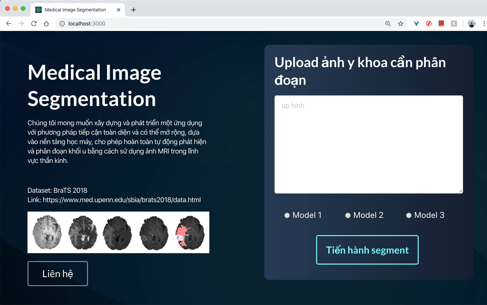

# MedSegProjK16-Web

This repository contains web content of the thesis project of a team in Honor Program of the Faculty of Computer Science and Engineering class 2016, instructed by Dr. Duc Dung Nguyen.

# How to run

```
$ cd medseg
$ npm install
$ npm start
```

# App layout



# Api backend
| URI        | Client           | Response  |
| ------------- |:-------------:| -----:|
| /api-file/sendfile      |POST, {file: filestream} | {status: 200, message: Send successfully, **key: abc**} |
| /api-pred/getmask      | POST, {key: abc}      |  File label: **key.nii.gz**  |
| /api-pred/getgif  | POST, {key: abc, **modal_type: t1ce**}      |  File gif: key_modal_type_masked.gif  |

# Backend set up

- The backend is built with Python Flask.
- It is recommended to use virtualenv to build: [instruction link](https://packaging.python.org/guides/installing-using-pip-and-virtual-environments/)

```
$ cd medseg/server
$ pip3 install -r requirement.txt
$ mkdir file_container
$ mkdir pre_train_model
$ python3 app.py
```

# Demo
<h4>Left: grouth truth, right: prediction (validation)</h4>


<h4>Left: t1ce modality, right: prediction (test)</h4>

